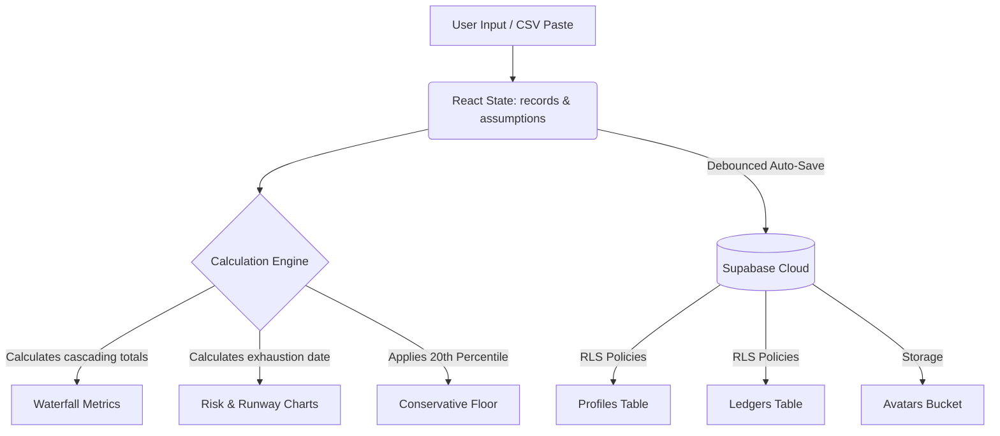

# CashFloor 🟢

**The Professional Ledger for Irregular Income.**  
CashFloor is an educational simulation tool and professional ledger designed specifically for freelancers, consultants, and independent professionals. It translates unpredictable income streams into a mathematically secure runway, eliminating financial anxiety through the "20th Percentile Rule" and automated stress testing.

---

## 🎯 Target Users & Audience
- **Freelancers & Independent Contractors:** Professionals dealing with variable, irregular income month-to-month.
- **Agency Owners & Solo Consultants:** Businesses that rely on retainers with a high risk of sudden client churn.
- **Creators & Gig Workers:** Individuals seeking a conservative baseline (financial floor) rather than naive average-based budgeting.

## 💡 How This Helps (Value Proposition)
Traditional budgeting software assumes a steady bi-weekly paycheck. When a freelancer uses standard budgeting apps, a single slow month can break their financial system.
CashFloor solves this by:
1. **Using Conservative Math (The 20th Percentile):** We calculate your runway based on your worst months, not a naive average. You will never be caught off-guard.
2. **Automated Tax Partitioning:** Instantly escrows a percentage of every dollar earned for taxes, so your "Ending Cash" is your *real* cash.
3. **Scenario Testing (The Lab):** Instantly simulate catastrophic events (e.g., losing a 30% client, a $10,000 unexpected expense) locally in the browser to see the exact date your money runs out.

---

## 🎨 UI/UX & Theme Info
CashFloor is designed to feel **premium, secure, and calm**. It borrows aesthetic cues from high-end fintech tools (like Stripe and Linear) and elite banking.

- **Color Palette:** Deep Emeralds (`#2F6F62`), Dark Slate Blues (`#16232B`), and subtle warm/gold accents for warnings.
- **Atmosphere:** Dark Mode by default. Extensive use of Glassmorphism (blur backdrops), smooth glowing borders, and radial gradients.
- **Typography:** Elegant Serifs for headings (evoking trust and established finance) mixed with stark, highly legible Monospace fonts for numbers and data.
- **Animations:** Built with `framer-motion`. Includes cinematic ultra-smooth scroll parallax, 3D holographic tilt cards, staggered Bento grid reveals, and micro-interactions on hover.

---

## 🌊 User Flow
1. **Landing Page (Marketing):** User lands on the homepage, experiences the cinematic 3D scrolling animations explaining the 20th Percentile Rule.
2. **Authentication:** User clicks "Open the Studio" and is prompted with a sleek modal to Sign In / Sign Up via Supabase Auth.
3. **Data Onboarding:** User lands on the Dashboard. If empty, a "Pro Tip" guides them to export a CSV from Upwork, Stripe, or QuickBooks.
4. **Data Entry (Paste Modal):** User pastes their raw CSV data. The parser automatically structures it into the ledger.
5. **Assumption Tuning:** User adjusts the top control bar (Tax Reserve %, Savings Buffer, Starting Balance).
6. **Stress Testing:** User selects a Scenario (e.g., "Client Churn (30% Loss)"). The calculation engine immediately recalculates the cascading cash flow and updates all charts at 60fps.
7. **Monetization (Paywall):** Advanced metrics and certain scenarios trigger a paywall routing the user to the `/pricing` page.

---

## 📊 Architecture & Flow Chart

CashFloor uses a **Local-First Calculation Engine** paired with a **Cloud Sync Layer** (Supabase) for data persistence across devices.

---

## 🗄️ Database Structure (Supabase PostgreSQL)

We use strict **Row Level Security (RLS)** ensuring users can only read and write their own encrypted financial data.

1. **`auth.users`** (Supabase native)
2. **`public.profiles`**
   - `id` (uuid, references `auth.users`)
   - `full_name` (text)
   - `avatar_url` (text - points to `avatars` bucket)
   - `default_currency` (text)
   - `default_tax_rate` (numeric)
3. **`public.ledgers`**
   - `id` (uuid)
   - `user_id` (uuid, references `auth.users`)
   - `name` (text) - *A user can have multiple ledgers (e.g. "Agency", "Personal")*
4. **`public.ledger_records`**
   - `id` (uuid)
   - `ledger_id` (uuid)
   - `month` (text)
   - `income` (numeric)
   - `expenses` (numeric)
   - `sort_order` (integer)
5. **`public.ledger_assumptions`**
   - `ledger_id` (uuid)
   - `tax_reserve_pct` (numeric)
   - `buffer_months_multiplier` (numeric)
   - `current_savings` (numeric)
   - `scenario` (text)

*(A trigger function automatically creates a `profiles` row when a new user signs up in `auth.users`)*

---

## 🧪 Tests Done
- **Unit Testing (Engine):** The core mathematical engine (`engine.ts`) is fully covered by Vitest. Tests verify that the cascading logic correctly deducts taxes, handles negative net changes, and accurately calculates the 20th percentile mathematical floor.
- **E2E Testing (Playwright):** Automated tests exist for critical user journeys, including the Blog/SEO rendering and the Auth flow.
- **Component Isolation:** The dashboard layout handles `isLocked` paywall gating flawlessly, preventing unauthorized access to premium widgets.
- **Type Safety:** The entire application strictly adheres to TypeScript interfaces, resulting in zero `tsc` build errors.

---

## 🚀 Use Cases
1. **The Feast-or-Famine Freelancer:** Just landed a massive $20k contract, but has no guaranteed work next month. CashFloor automatically escrows taxes and shows them exactly how many months of runway that $20k provides based on their historical worst-case spending.
2. **The Agency Owner:** Wants to hire a new contractor but isn't sure if they can afford it. They use the **Scenario Tester** in CashFloor to add a theoretical expense and instantly see if their exhaustion date drops below the 6-month safety buffer.
3. **The Consultant Preparing for Taxes:** Pastes their entire 12-month QuickBooks export into CashFloor to immediately see their exact tax liability and ensure they haven't drawn too much personal cash.
