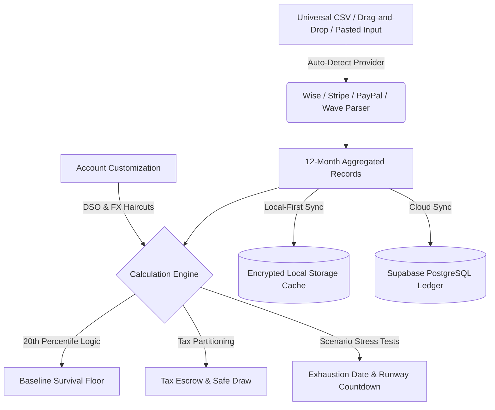

# CashFloor 🟢

**The Professional Financial Cockpit & Runway Engine for Irregular Income.**  
CashFloor is a commercial-grade fintech web application designed specifically for international freelancers, solo consultants, boutique agencies, and independent professionals. It translates unpredictable revenue streams into a mathematically sound forward runway, eliminating volatility panic through the empirical **20th Percentile Rule**, structural tax escrow, and automated stress testing.

---

## 🎯 Target Users & Audience
- **International Freelancers & Remote Contractors:** Professionals receiving multi-currency payments (USD, EUR, GBP) via Wise, Stripe, and PayPal with irregular billing cycles.
- **Consultants & Agency Owners:** Businesses managing client retainers with exposure to late payments (Net-30/60 DSO) and client churn.
- **Solopreneurs & Knowledge Workers:** Independent creators seeking a conservative baseline (financial floor) rather than naive average-based budgeting.

---

## 💡 Core Pillars & Value Proposition
Traditional budgeting software assumes a steady bi-weekly salary. For independent professionals with feast-or-famine income cycles, averages create a dangerous mathematical illusion:
1. **The 20th Percentile Floor:** Calculates forward runway from historical worst-case cycles, ensuring personal burn is always protected against drought periods.
2. **Automated Tax Partitioning (5-Pillar Protocol):** Structurally locks away tax reserves (e.g. 25%) before funds can be drawn for personal spending.
3. **Multi-Scenario Stress Testing:** Simulates client churn (e.g. 30% revenue drop), contract delays, and emergency expenses to pinpoint the exact zero-cash exhaustion date.
4. **Client Customization Architecture:** Configures legal entity rules (LLC, S-Corp, Sole Proprietorship), DSO payment lag (Net-15/30/60), target safety buffers, and FX volatility haircuts.
5. **Zero-Surveillance Universal Ingestion:** Instantly ingests and parses CSV exports from **Wise**, **Stripe**, **PayPal**, **Upwork**, and **Wave Accounting** with 100% client-side processing—zero bank credentials or surveillance required.

---

## 🎨 UI/UX & Brand Aesthetics
- **Geometric Brand Emblem:** A custom SVG mark featuring the baseline safety floor datum line, an ascending runway trajectory, and an emerald equilibrium node (`#3DE8C8`).
- **Curated Palette:** Deep Emeralds (`#2F6F62`), Dark Slate Blues (`#16232B`), and warm amber caution accents.
- **Seamless Local-First Hydration:** Zero-flicker state loading ensures dashboard calibration badges and navigation avatar states load with frame-1 stability.
- **Dynamic Micro-Interactions:** Smooth Framer Motion transitions, interactive Annual/Monthly pricing toggles with live discount badges, and responsive tooltips.

---

## 🌊 Application Architecture & User Flow

---

## 🛠️ Supported Integrations & File Formats

| Provider | Export Type | Detected Columns | Ingestion Mode |
| :--- | :--- | :--- | :--- |
| **Wise (TransferWise)** | Balance Statement CSV | `TransferWise ID`, `Date`, `Amount`, `Total fees` | Auto-detect credits/debits |
| **Stripe Invoicing** | Balance History CSV | `Created (UTC)`, `Amount`, `Fee`, `Net`, `Type` | Normalizes charges & fees |
| **PayPal** | Completed Activity CSV | `Date`, `Gross`, `Fee`, `Net`, `Status` | Completed transactions only |
| **Upwork / Platforms** | Transaction History CSV | `Date`, `Ref ID`, `Amount`, `Type` | Separates earnings from withdrawals |
| **Wave / QuickBooks** | General Ledger CSV | `Date`, `Debit`, `Credit` / `Split`, `Amount` | Aggregates income & business expenses |
| **Spreadsheets** | Excel / Google Sheets | Tab, Comma, or Semicolon separated columns | Instant clipboard paste |

---

## 📰 Real-Time Freelance Knowledge Feed
CashFloor streams real, published articles from the free public **Dev.to REST API** (`https://dev.to/api/articles?tag=freelance&per_page=9`), combined with our cornerstone methodology guides:
- *The 20th Percentile Math: Why Average Income is a Trap for Freelancers*
- *The 5-Pillar Partition: How to Structurally Separate Taxes, Runway, and Living Draws*
- *Cross-Border Contractor FX Buffering: Defending Against Currency Swings in USD/EUR*

---

## 🧪 Testing & Verification
- **Vitest Unit Suite:** 27/27 unit tests passing across calculation engine, universal CSV parsing, date normalization, and auth logic.
- **Production Build:** Fully verified with Next.js 16 (Webpack) and TypeScript with zero compilation errors.

---

## 💻 Tech Stack
- **Framework:** Next.js 16 (App Router), React 19, TypeScript
- **Styling:** Vanilla CSS Custom Properties (`--cf-*`), Tailwind CSS v4
- **Animations:** Framer Motion
- **Database & Auth:** Supabase (PostgreSQL, Row-Level Security, Auth)
- **Visuals & Charts:** Recharts, Lucide Icons
- **Testing:** Vitest
